# Сети в Linux

Настройка сетей в Linux на виртуальных машинах

## Оглавление
[Часть 1. Инструмент ipcalc](#часть-1-инструмент-ipcalc)  
[Часть 2. Статическая маршрутизация между двумя машинами](#часть-2-статическая-маршрутизация-между-двумя-машинами)  
[Часть 3. Утилита iperf3](#часть-3-утилита-iperf3)  
[Часть 4. Сетевой экран](#часть-4-сетевой-экран)  
[Часть 5. Статическая маршрутизация сети](#часть-5-статическая-маршрутизация-сети)  
[Часть 6. Динамическая настройка IP с помощью DHCP](#часть-6-динамическая-настройка-ip-с-помощью-dhcp)  
[Часть 7. NAT](#часть-7-nat)  
[Часть 8. Допополнительно. Знакомство с SSH Tunnels](#часть-8-дополнительно-знакомство-с-ssh-tunnels) 

## Часть 1. Инструмент ipcalc

>ipcalc предоставляет простой метод для вычисления IP-информации хоста. 

### 1.1. Сети и маски

Устанавливаю утилиту `sudo apt-get install ipcalc`

#### Адрес сети 192.167.38.54/13

Вычисляю адрес сети `ipcalc 192.167.38.54/13`

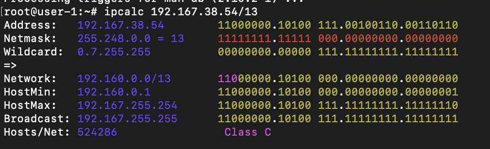

- 192.160.0.0/13

#### Перевод маски 255.255.255.0 в префиксную и двоичную запись

Вычисляю маску сети `ipcalc 0.0.0.0/255.255.255.0`

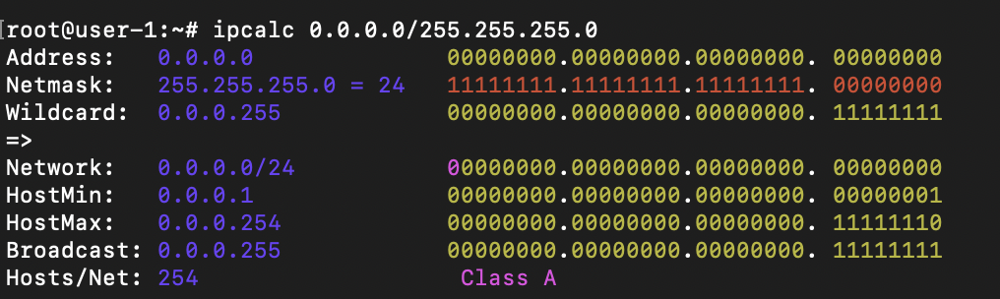

- 11111111.11111111.11111111.00000000 - двоичная запись

- 24 - префиксная запись

#### Перевод маски /15 в обычную и двоичную запись

Вычисляю маску сети `ipcalc 0.0.0.0/15`

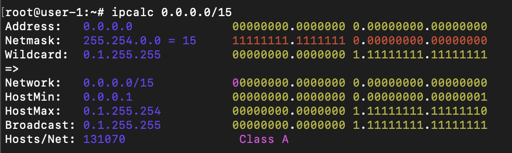

- 255.254.0.0 - обычный вид

- 11111111.11111110.00000000.00000000 - двоичная запись

#### Перевод маски 1111111.11111111.11111111.11110000 в обычную и префиксную запись

>ipcalc не работает с двоичной записью

Вычисляю маску сети `ipcalc 0.0.0.0/28`

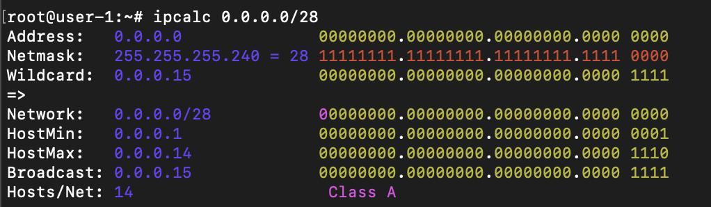

- 255.255.255.240 - обычный вид

- 28 - префиксная запись

#### Минимальный и максимальный хост в сети 12.167.38.4/8, 11111111.11111111.00000000.00000000, 255.255.254.0 и /4

`ipcalc 12.167.38.4/8`

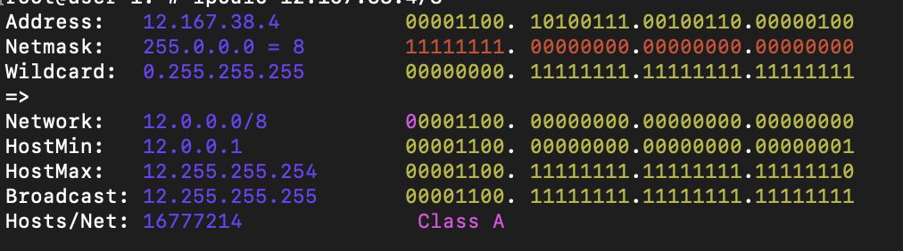

- HostMin: 12.0.0.1
- HostMax: 12.255.255.254

#### Минимальный и максимальный хост в сети 12.167.38.4/11111111.11111111.00000000.00000000

`ipcalc 12.167.38.4/16`

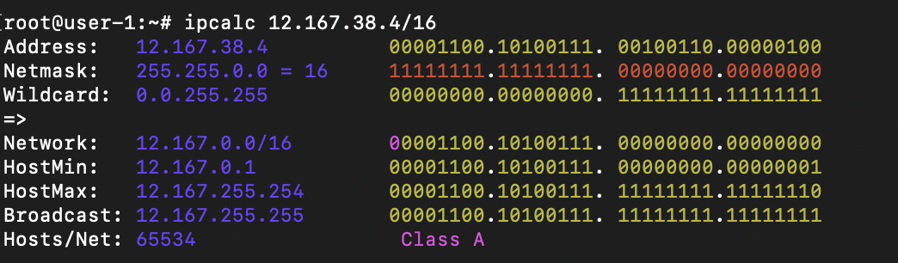

- HostMin: 12.167.0.1
- HostMax: 12.167.255.254

#### Минимальный и максимальный хост в сети 12.167.38.4/255.255.254.0 

`ipcalc 12.167.38.4/255.255.254.0`

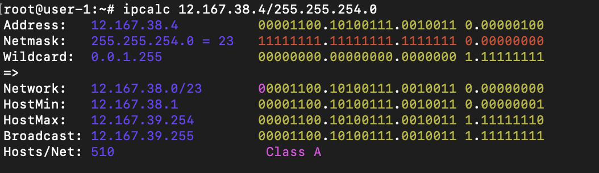

- HostMin: 12.167.38.1
- HostMax: 12.167.39.254

#### Минимальный и максимальный хост в сети 12.167.38.4/4

`ipcalc 12.167.38.4/4`

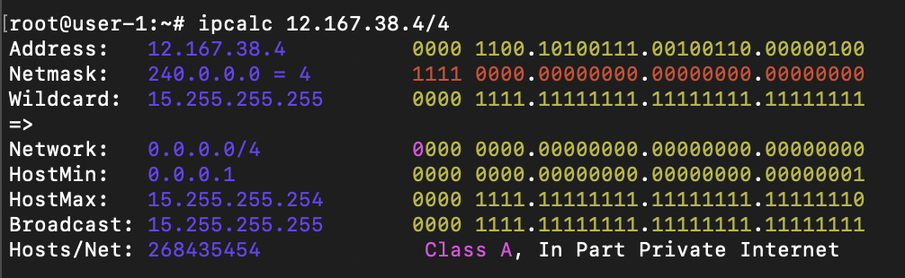

- HostMin: 0.0.0.1
- HostMax: 15.255.255.254

### 1.2. localhost

`ipcalc 194.34.23.100`

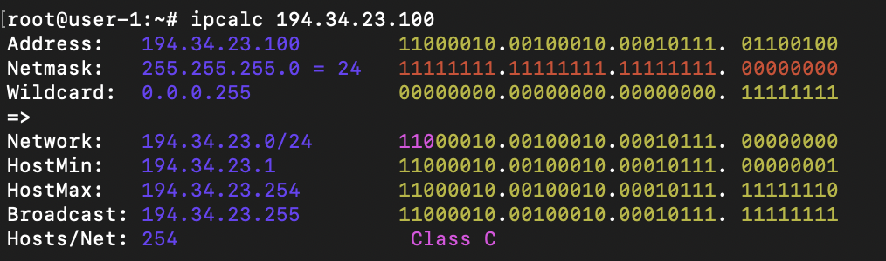

- Нельзя обратиться

`ipcalc 127.0.0.2`

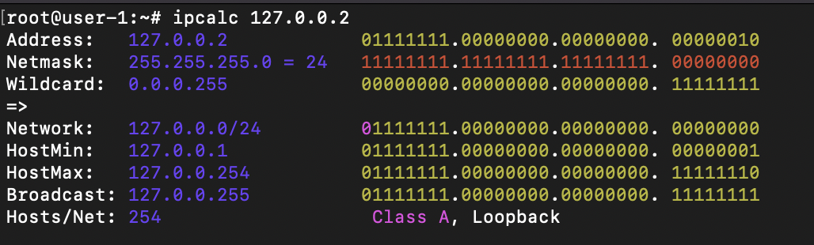

- Можно обратиться

`ipcalc 127.1.0.1`

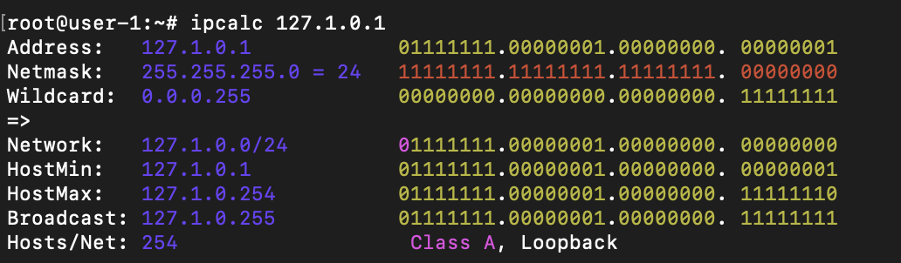

- Можно обратиться

`ipcalc 128.0.0.1`

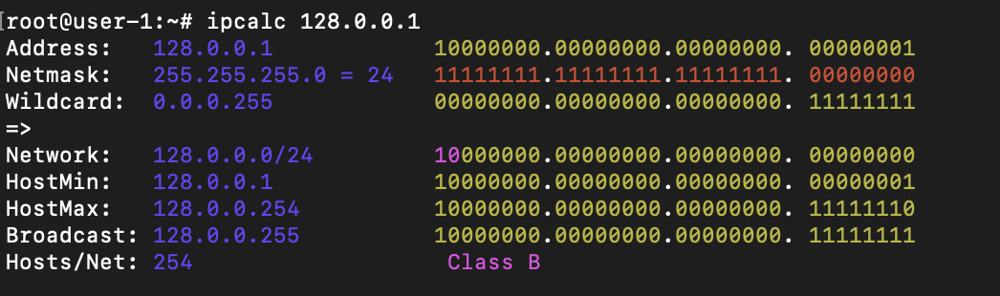

- Нельзя обратиться

### 1.3. Диапазоны и сегменты сетей
#### какие из перечисленных IP можно использовать в качестве публичного, а какие только в качестве частных: 10.0.0.45, 134.43.0.2, 192.168.4.2, 172.20.250.4, 172.0.2.1, 192.172.0.1, 172.68.0.2, 172.16.255.255, 10.10.10.10, 192.169.168.1

`ipcalc 10.0.0.45`

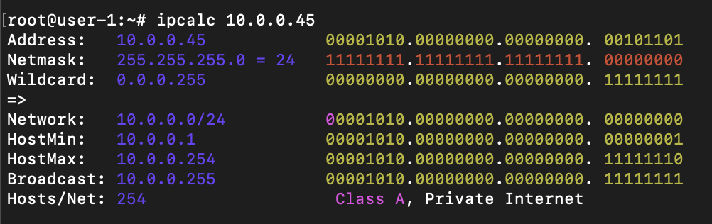

- Частный IP

`ipcalc 134.43.0.2`

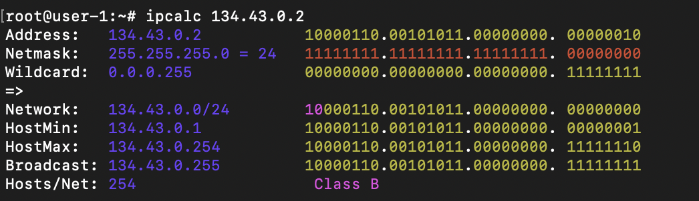

- Публичный IP

`ipcalc 192.168.4.2`

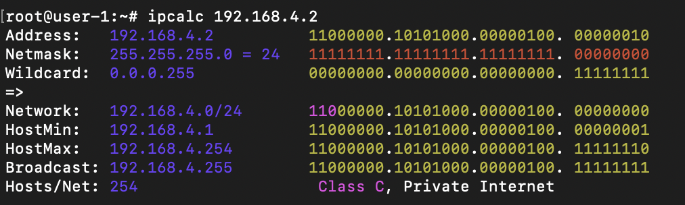

- Частный IP

`ipcalc 172.20.250.4`

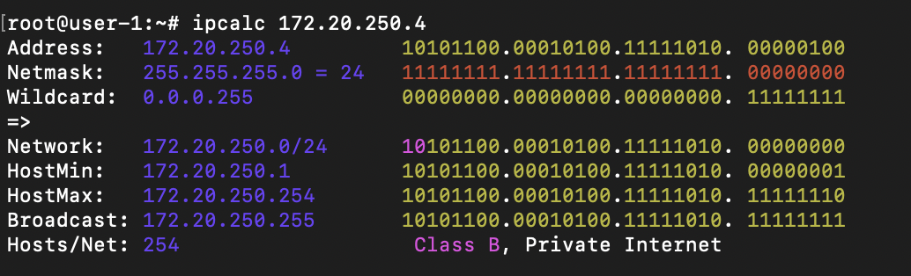

- Частный IP

`ipcalc 172.0.2.1`

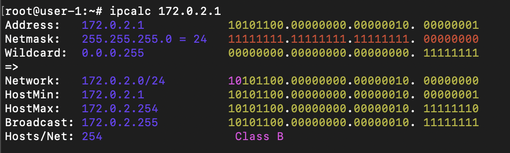

- Публичный IP

`ipcalc 192.172.0.1`

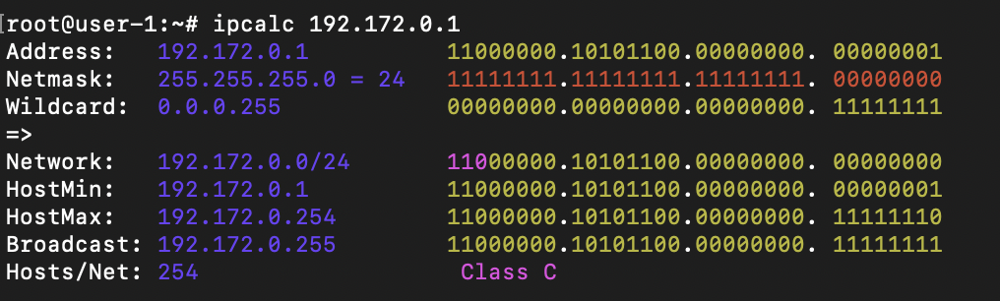

- Публичный IP

`ipcalc 172.68.0.2`

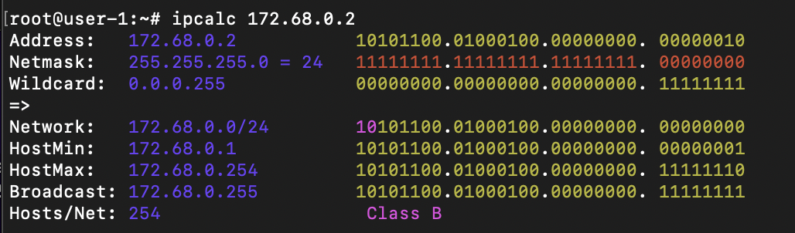

- Публичный IP

`ipcalc 172.16.255.255`

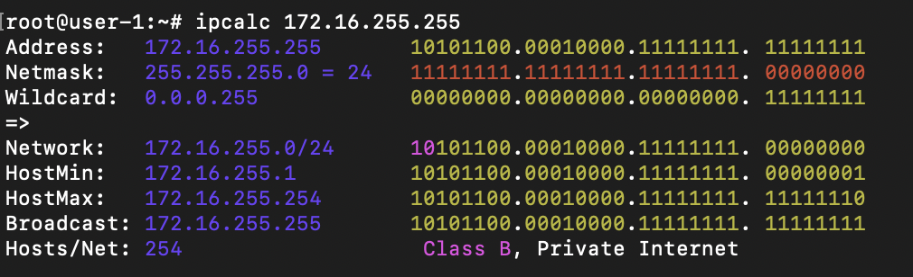

- Частный IP

`ipcalc 10.10.10.10`

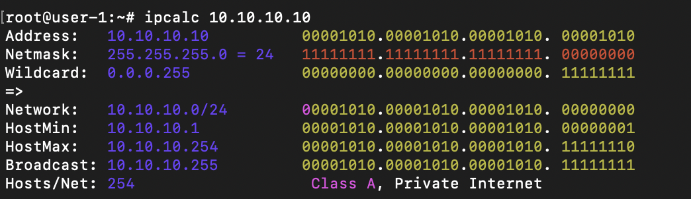

- Частный IP

`ipcalc 192.169.168.1`

- Публичный IP

Частные:
- 10.0.0.45
- 192.168.4.2
- 172.20.250.4
- 172.16.255.255
- 10.10.10.10

Публичные:
- 134.43.0.2
- 172.0.2.1
- 192.172.0.1
- 172.68.0.2
- 192.169.168.1

#### какие из перечисленных IP адресов шлюза возможны у сети 10.10.0.0/18: 10.0.0.1, 10.10.0.2, 10.10.10.10, 10.10.100.1, 10.10.1.255

`ipcalc 10.10.0.0/18`

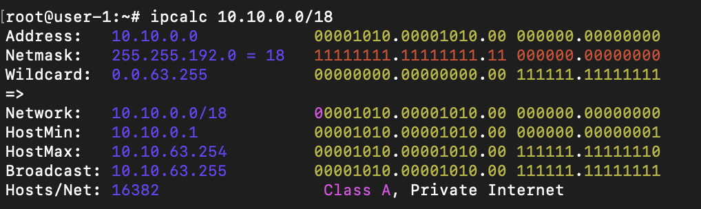

- HostMin: 10.10.0.1
- HostMax: 10.10.63.254

Возможные шлюзы для сети: 10.10.0.2, 10.10.10.10, 10.10.1.255

## Часть 2. Статическая маршрутизация между двумя машинами
#### Поднять две виртуальные машины (далее -- ws1 и ws2)

Клонирую первую машину, добавляю локальную сеть, устанавливаю имя хоста ws2 `sudo hostnamectl set-hostname ws2`

##### С помощью команды ip a посмотреть существующие сетевые интерфейсы

ws1 `ip a`

ws2 `ip a`

##### На обеих машинах задать следующие адреса и маски: ws1 - 192.168.100.10, маска /16, ws2 - 172.24.116.8, маска /12

Для каждой из машин `sudo nano /etc/netplan/00-installer-config.yaml` 

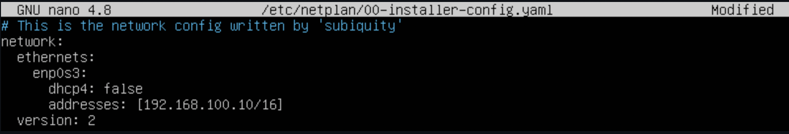
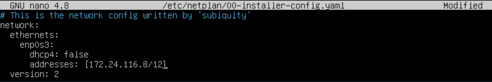

Применяем настройки `sudo netplan apply` 

### 2.1. Добавление статического маршрута вручную

`sudo ip r add 172.24.116.8 dev enp0s3`

`sudo ip r add 192.168.100.10 dev enp0s3`

#### Пингую соединение между машинами

`ping -c 4 172.24.116.8`

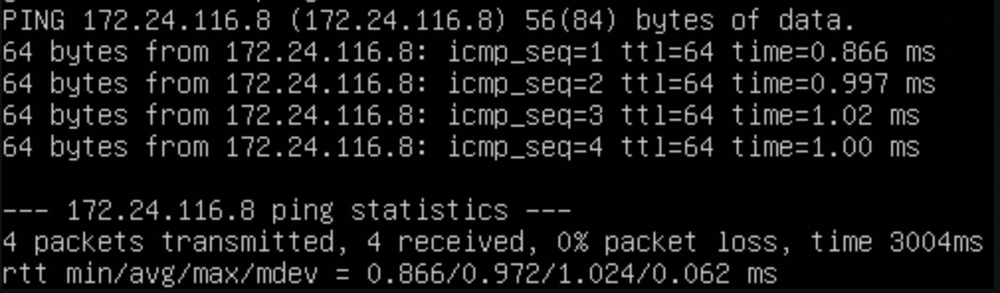

`ping -c 4 192.168.100.10`

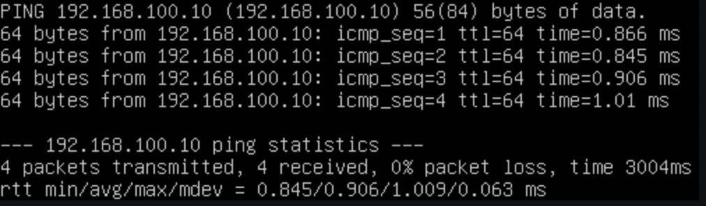

### 2.2. Добавление статического маршрута с сохранением

Перезапускаю машины `sudo reboot`

#### Добавить статический маршрут от одной машины до другой с помощью файла etc/netplan/00-installer-config.yaml

Для каждой из машин `sudo nano /etc/netplan/00-installer-config.yaml` 

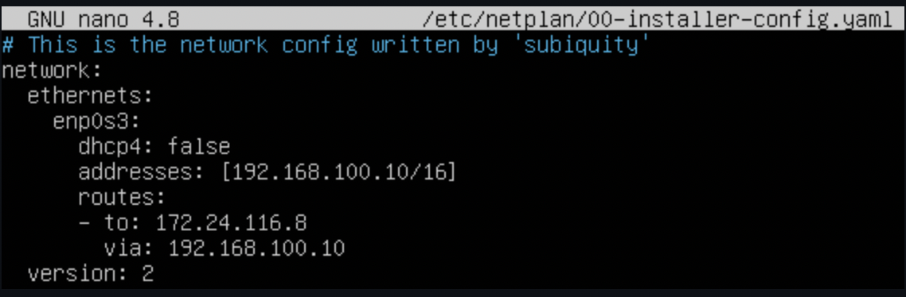
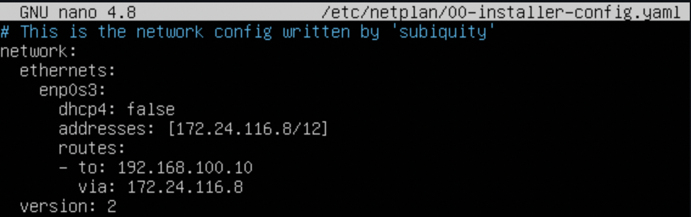

Применяем настройки `sudo netplan apply` 

#### Пингую соединение между машинами

`ping -c 4 172.24.116.8`

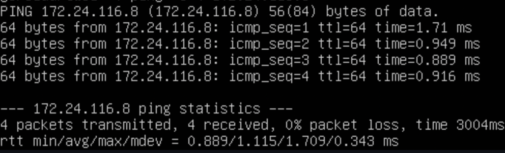

`ping -c 4 192.168.100.10`

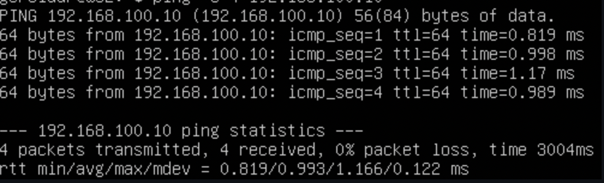

## Часть 3. Утилита iperf3
#### Перевести и записать в отчёт: 8 Mbps в MB/s, 100 MB/s в Kbps, 1 Gbps в Mbps

- 8 Mbps = 1 MB/s
- 100MB/s = 800000Kbps
- 1Gbps = 1000Mbps

#### Измерить скорость соединения между ws1 и ws2

Слушаю на стороне сервера `iperf3 -s`

На стороне клиента `-с 192.168.100.10`

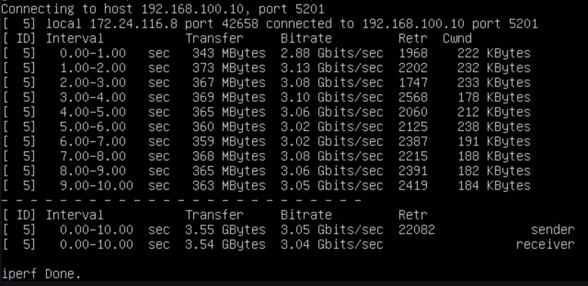

## Часть 4. Сетевой экран

### 4.1. Утилита iptables

Создаю файл /etc/firewall.sh, имитирующий фаервол на обеих машинах `sudo nano /etc/firewall.sh`

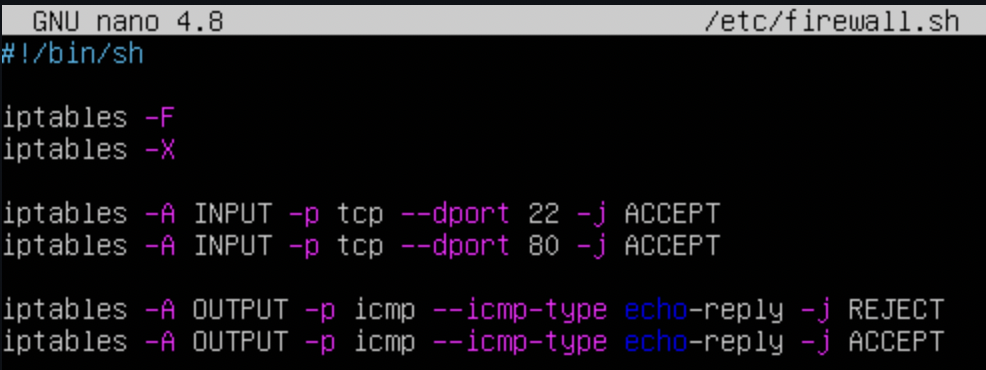

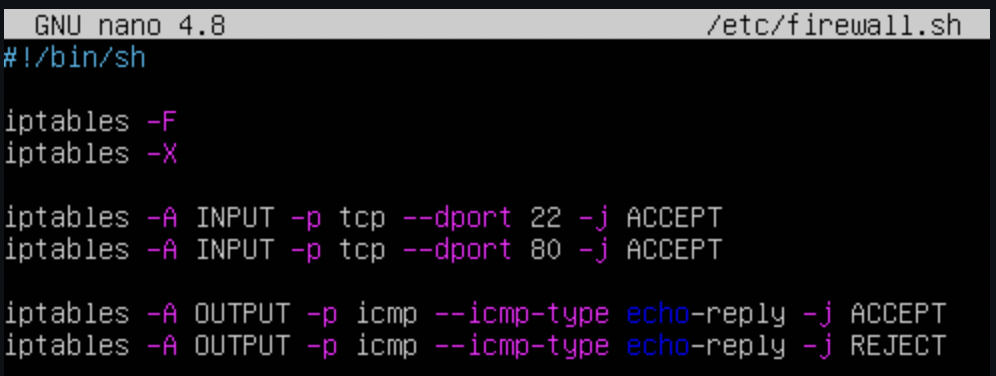

Запускаю файлы на обеих машинах командами `sudo chmod +x /etc/firewall.sh` и `sudo /etc/firewall.sh`

> Разница заключается в порядке исполнения правил: в первом случае, пакет будет отклонен, во втором - принят.

### 4.2. Утилита nmap

 Пингую со второй машины на первую `ping 192.168.100.10`

Затем вызываю утилиту nmap `sudo nmap 192.168.100.10`

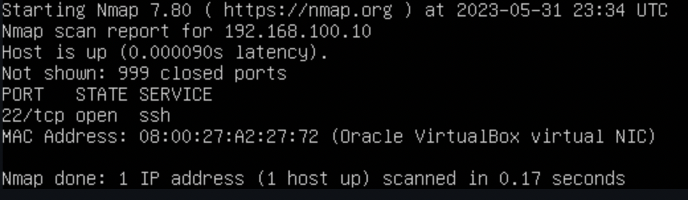

## Часть 5. Статическая маршрутизация сети
### 5.1. Настройка адресов машин
#### Настраиваю конфигурацию машин согласно схеме на рисунке

ws11 

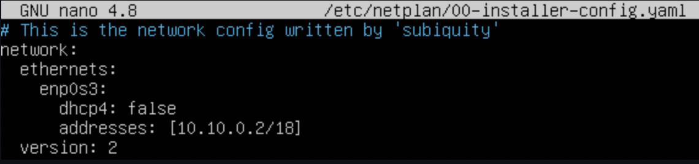

ws22

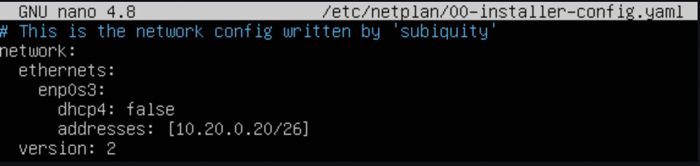

ws21 

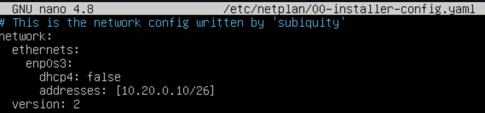

r1

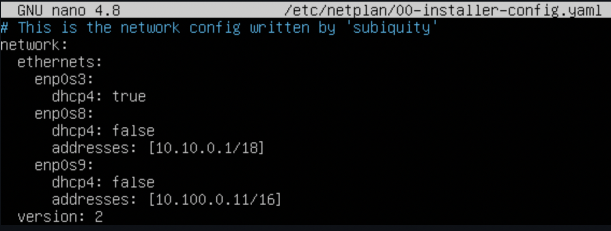

r2

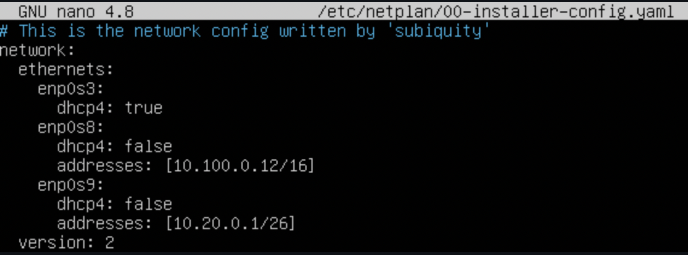

Применяю настройки на каждой из машин `sudo netplan apply`

Проверяю настройки на каждой машине `ip -4 a`

ws11 

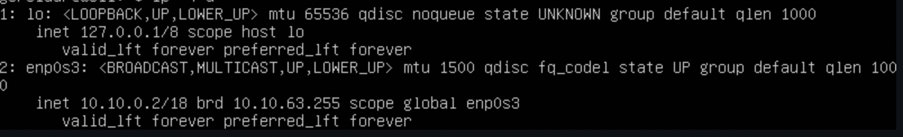

ws22 

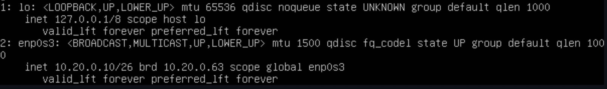

ws21 

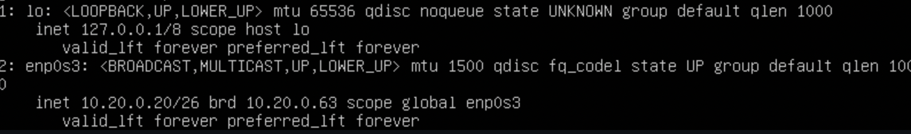

r1 

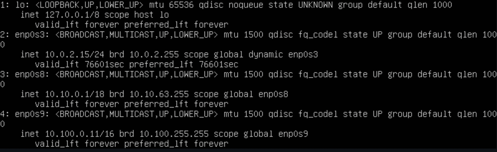

r2

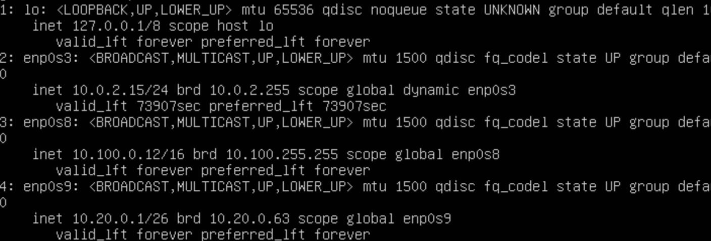

Пингую ws22 с ws21 `ping -c 4 10.20.0.20`

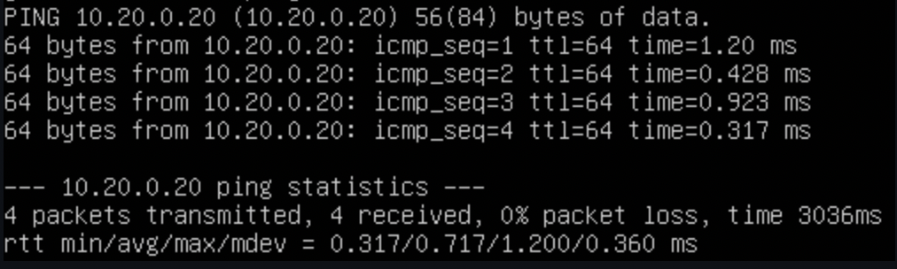

Пингую r1 с ws11 `ping -c 4 10.10.0.1`

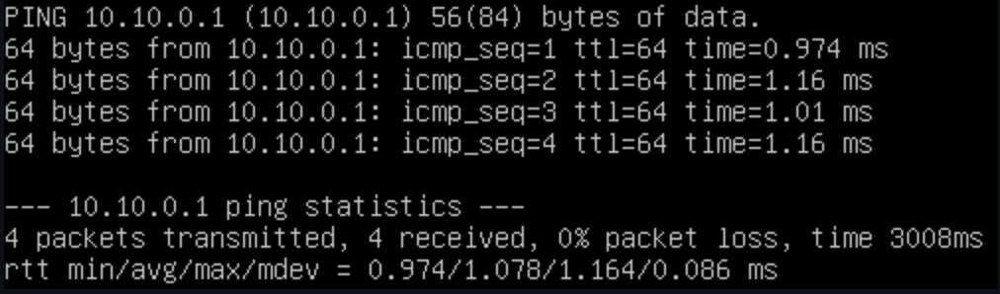

### 5.2. Включение переадресации IP-адресов.

Включаю переадресацию IP, на роутерах `sudo sysctl -w net.ipv4.ip_forward=1`

Открываю файл конфигурации на обеих машинах `sudo nano /etc/sysctl.conf`

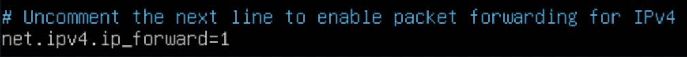

### 5.3. Установка маршрута по-умолчанию
#### Настриваю маршрут по-умолчанию (шлюз) для рабочих станций
ws11 

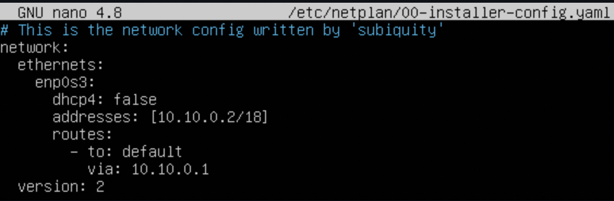

ws22

ws21 

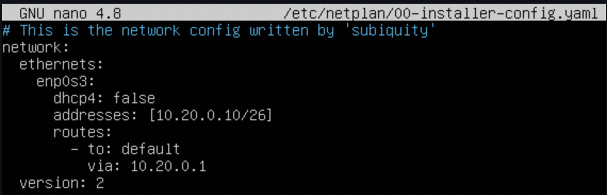

Применяю настройки на каждой из машин `sudo netplan apply`

#### Проверею таблицы маршрутиризации

ws11 `ip r`

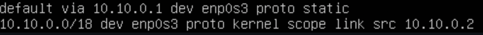

ws22 `ip r`


ws21 `ip r`


#### Пингую r2 с ws11

`ping -c 4 10.100.0.12`


Смотрю в r2 `sudo tcpdump -tn -i enp0s8`


### 5.4. Добавление статических маршрутов

Добавляю в роутеры r1 и r2 статические маршруты в файле конфигурации

r1


r2


Применяю настройки на обеих роутерах `sudo netplan apply`

r1 `ip r`


r2 `ip r`

Запускаю команды `ip r list 10.10.0.0/18` и `ip r list 0.0.0.0/0` на ws11

>ws11 соединена с сетью 10.10.0.0/18 поэтому, подключение произошло напрямую, но не соединена с 0.0.0.0/0 - сработало дефолное подключение через роутер.

### 5.5. Построение списка маршрутизаторов

 Запускаю команду дампа на r1 `sudo tcpdump -tnv -i enp0s8`


На ws11 `traceroute 10.20.0.10`


### 5.6. Использование протокола ICMP при маршрутизации

Запускаю на r1 перехват сетевого трафика `tcpdump -n -i enp0s8 icmp`


Пингую с ws11 несуществующий IP `ping -c 1 10.30.0.111`


## Часть 6. Динамическая настройка IP с помощью DHCP

#### Для r2 настраиваю конфигурацию службы DHCP:

Устанавливаю утилиту `sudo apt-get install isc-dhcp-server`

Открываю конфиг и добавляю изменения в r2 `sudo nano  /etc/dhcp/dhcpd.conf`


В файл resolv.conf прописываю nameserver 8.8.8.8

Перезагружаю службу DHCP `systemctl restart isc-dhcp-server` и проверяю ее статус `systemctl status isc-dhcp-server`


Обновляю настройки в ws21 и ws22


Применяю настройки на обеих машинах `sudo netplan apply`

Перезагружаю ws21 `sudo reboot`

Проверяю, полученный от DHCP адрес

ws21 `ip a`


ws22 `ip a`


Пингую ws22 с ws21  `ping -c 4 10.20.0.5`


Указываю MAC адрес у ws21

В настройках VB


В конфигурационном файле


#### Для r1 настраиваю аналогично r2, но делаю выдачу адресов с жесткой привязкой к MAC-адресу (ws11)

Устанавливаю утилиту `sudo apt-get install isc-dhcp-server`

Открываю конфиг и добавляю изменения в r1 `sudo nano  /etc/dhcp/dhcpd.conf`


В файл resolv.conf прописываю nameserver 8.8.8.8

Перезагружаю службу DHCP `systemctl restart isc-dhcp-server` и проверяю ее статус `systemctl status isc-dhcp-server`


Обновляю настройки в ws11


Применяю настройки `sudo netplan apply`

ws11 `ip a`


Пингую ws11 с ws22  `ping -c 4 10.10.0.2`


#### Запрашиваю с ws21 обновление ip адреса

ip на ws21 до запроса нового `ip a`


Запрос нового ip `sudo dhclient -v`

> -v - получение нового ip

ws11 `ip a`

## Часть 7. NAT

Устанавливаю apache `sudo apt install apache2`

В файле /etc/apache2/ports.conf на ws22 и r1 меняю строку Listen 80 на Listen 0.0.0.0:80


Запускаю веб-сервер на ws22 и r1 `service apache2 start` и проверяю `systemctl status apache2`


Создаю файл /etc/firewall.sh, имитирующий фаервол на r2 `sudo nano /etc/firewall.sh`


Запускаю файл `sudo chmod +x /etc/firewall.sh` и `sudo /etc/firewall.sh`

Пингую ws22 с r1 


Добавляю в фаервол еще одно правило


Пингую ws22 с r1 

Добавляю еще правила в фаервол


>- t - указывает на используемую таблицу
>- p - указывает протокол, такие как tcp, udp, udplite и другие, поддерживаемые системой, ознакомиться со списком можно в файле /etc/protocols
>- m - подключает указанный модуль
>- s - указывает адрес источника пакета, в качестве значения можно указать как один IP-адрес, так и диапазон;
>- i - задает входящий сетевой интерфейс
>- o - указывает исходящий сетевой интерфейс
>- --dport - порт получателя пакета
>- DNAT — подменяет адрес получателя в заголовке - IP-пакета, основное применение — предоставление доступа к сервисам снаружи, находящимся внутри сети
>- SNAT — служит для преобразования сетевых адресов, применимо, когда за сервером находятся машины, которым необходимо предоставить доступ в Интернет, при этом от провайдера имеется статический IP-адрес

Запускаю `sudo /etc/firewall.sh`

Проверяю соединение по TCP для SNAT, для этого с ws22 подключаюсь к серверу Apache на r1 `sudo telnet 10.100.0.11 80`

## Часть 8. Допополнительно. Знакомство с SSH Tunnels

Устанавливаю apache на ws22 `sudo apt install apache2`

В файле /etc/apache2/ports.conf меняю строку Listen 80 на Listen localhost:80

Запускаю веб-сервер на ws22  `service apache2 start` и проверяю `systemctl status apache2`

Запускаю фаервол на r2 `sudo /etc/firewall.sh`

Local TCP forwarding с ws21 до ws22

Remote TCP forwarding c ws11 до ws22

[Оглавление](#оглавление)
